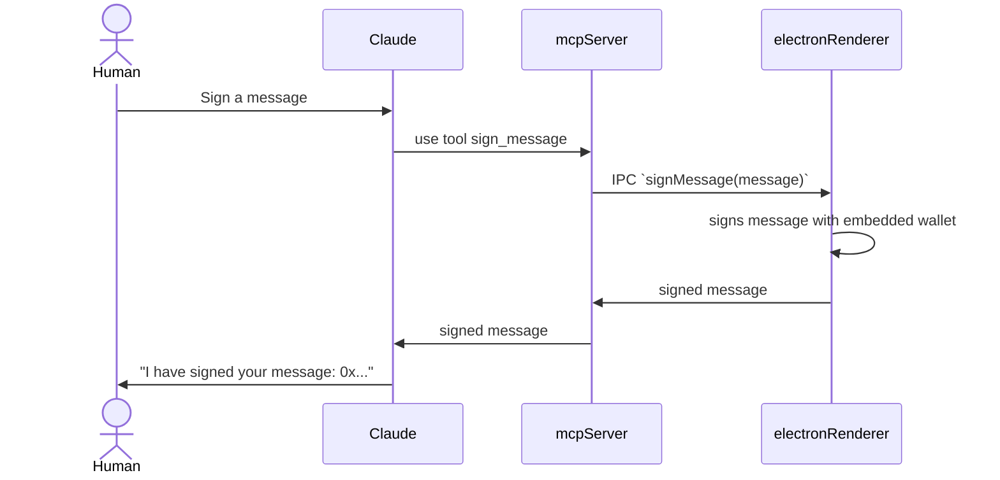

# x402-MCP

## Development

```bash
pnpm install && node node_modules/electron/install.js
```

Develop the electron app

```bash
pnpm run dev
```

Run the mcp server (rebuilds assets and starts the mcp server + electron app)

```bash
pnpm run build   # builds the assets
pnpm run mcp     # starts the mcp server + electron app using the built assets
```

Add as an MCP server for Claude, in `claude_desktop_config.json` (`cmd + ,` -> Developer -> Edit Config)

```json
{
  "mcpServers": {
    "x402-wallet": {
      "command": "pnpm",
      "args": [
        "--silent",
        "-C",
        "<absolute path to this repo>/examples/typescript/mcp-embedded-wallet",
        "run",
        "mcp"
      ],
      "env": {}
    }
  }
}
```

Then restart Claude.

Note that Claude will run an instance of the MCP server on startup, so you don't need to have it running in the background. You will need to rebuild the assets and restart Claude in order to see changes.

## How does this work?

This is an mcp server that also happens to be an electron app. It uses an embedded wallet stored in
the electron browser process to sign requests while being sandboxed from the rest of the OS. The MCP server can request signatures via the main process <-> renderer process IPC bridge.

Basically there are 2 processes (the mcp server + electron main process) and the electron renderer (which is a chromium browser window), communication between them looks like this:



How do I add a new capability that gets exposed via MCP to Claude?

Great question. Right now you need to change a few files.

1. `preload.ts` - this is run on electron window creation and registers functions in the namespace allowing for IPC. You need to add a new IPC callback here. This code is executed in the electron window (exposed via `window.electron`)

```typescript
contextBridge.exposeInMainWorld("electron", {
  OnSignMessage: callback =>
    ipcRenderer.on("sign-message", (event, message) => {
      callback(message).then(signature => {
        console.log("sign-message-response", signature);
        // Send message back to main process
        ipcRenderer.send("sign-message-response", signature);
      });
    }),
  // Above: existing full example. Below: your fancy new thing ( the most minimal example)
  OnMyNewIPCHandler: callback => icpRenderer.on("my-message", (event, message) => {
    callback(message)
  });
  // Gotchya: functions can't use async syntax
});
```

If you want bi-dreictional communication you need something like `ipcRenderer.send("sign-message-response", signature);`

2. implement the callback in `src/ipc.ts`, then register it in `src/main.tsx`. The function in `ipc.ts` can
   be a full TS async function, but it is executed outside to context of the react render tree (using zustand stores for state syncing to react is recommended)

```typescript
// src/ipc.ts
export async function myNewIPCHandler() {
  // ...
}

// src/main.ts
window.electron.OnSignMessage(signMessage);
window.electron.OnMyNewIPCHandlder(myNewIPCHand;er)
```

We now have everything we need on the renderer side.

3. Set up call from electron

Call from electron live in `operations` in `electron.ts` just for convinience.
You might add something like this

```typescript
  myNewIPCHandler: {
    title: "My New IPC Handler",
    description: "My new IPC handler",
    tool: async (message: string): Promise<string> => {
      logger.info("myNewIPCHandler called", message);
      mainWindow?.webContents.send("my-message", message);
      return new Promise(resolve => {
        ipcMain.once("my-message-response", (event, response) => {
          logger.info("my-message-response from main", response);
          resolve(response);
        });
      });
    },
  },
```

The key lines are

```typescript
// Send a message via IPC to the OnMyNewIPCHandler callback we instrumented
mainWindow?.webContents.send("my-message", message);

// (optional) wait for a response. Note: .once vs .on
ipcMain.once("my-message-response", (event, response) => {});
```

4. Expose calls via MCP

You now have a function `operations.myNewIPCHandler.tool` that can be called from the node process, but accesses state in the browser context. And you can call it from the MCP server.

```typescript
server.registerTool(
  "sign_message",
  {
    title: operations.signMessage.title,
    description: operations.signMessage.description,
  },
  async () => {
    logger.info("sign_message tool called");
    return {
      content: [
        { type: "text", text: await operations.signMessage.tool("hello") },
      ],
    };
  }
);
```
