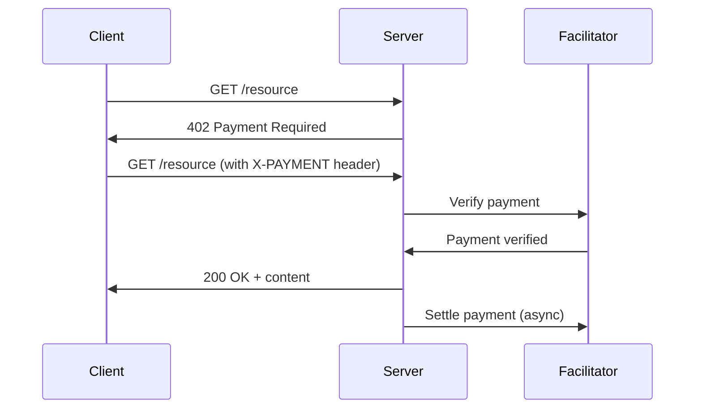

# x402 Java

[](https://github.com/coinbase/x402/java)
[](https://github.com/coinbase/x402/blob/main/LICENSE)
[](https://github.com/coinbase/x402/java)

Java implementation of [x402](https://github.com/coinbase/x402)

## Quick Start

```bash
# Build and test
mvn clean install

# Run tests
mvn test

# Check code coverage
mvn jacoco:report
mvn -P coverage verify  # Enforces 90% coverage

# Check code quality
mvn checkstyle:check
mvn spotbugs:check
```

## Overview

x402 is a system for decentralized payments for API calls, web content, and other HTTP resources. The `402` stands for the HTTP status code `Payment Required`.

This library provides a Java implementation of the `x402` protocol, with the following core components:

- `**PaymentFilter**`: A servlet filter that authenticates payments and rejects unauthorized requests
- `**FacilitatorClient**`: A client for verifying and settling payments with a facilitator service
- `**X402HttpClient**`: A convenience HTTP client for making payment-enabled requests

## Compatibility

- Java 17+
- Jakarta Servlet API or `javax.servlet`
- Works with any servlet container (Tomcat, Jetty, etc.)
- Compatible with Spring Boot, Quarkus, and other Java frameworks

## Installation

To use this library, you need to build and install it locally:

```bash
# Clone the repository
git clone https://github.com/coinbase/x402.git
cd x402/java

# Build and install to your local Maven repository
mvn clean install
```

Then add the dependency to your Maven project:

```xml
<dependency>
    <groupId>com.coinbase</groupId>
    <artifactId>x402</artifactId>
    <version>0.1.0-SNAPSHOT</version>
</dependency>
```

## Usage

### Server Side - Requiring Payments for Access

Integrate the `x402` filter into your servlet-based application to require payment for specific paths:

```java
import com.coinbase.x402.server.PaymentFilter;
import com.coinbase.x402.client.HttpFacilitatorClient;

import java.math.BigInteger;
import java.util.Map;

// 1. Define paths that require payment and their prices
Map<String, BigInteger> priceTable = Map.of(
    "/api/premium", BigInteger.valueOf(1000), // 1000 wei
    "/content/exclusive", BigInteger.valueOf(500)
);

// 2. Create a facilitator client
String facilitatorUrl = "https://x402.org/faciliator";
HttpFacilitatorClient facilitator = new HttpFacilitatorClient(facilitatorUrl);

// 3. Create and register the filter
String payToAddress = "0xYourReceiverAddress";
PaymentFilter paymentFilter = new PaymentFilter(payToAddress, priceTable, facilitator);

// 4. Register the filter with your servlet container
// In a standard servlet app:
FilterRegistration.Dynamic registration = servletContext.addFilter("paymentFilter", paymentFilter);
registration.addMappingForUrlPatterns(EnumSet.of(DispatcherType.REQUEST), true, "/*");

// Or in Spring Boot:
@Bean
public FilterRegistration paymentFilter(ServletContext servletContext) {
    FilterRegistration.Dynamic registration = servletContext.addFilter(
        "paymentFilter", 
        new PaymentFilter(payToAddress, priceTable, new HttpFacilitatorClient(facilitatorUrl))
    );
    registration.addMappingForUrlPatterns(EnumSet.of(DispatcherType.REQUEST), true, "/*");
    return registration;
}
```

### Client Side - Making Requests with Payment

To make HTTP requests that include payment proofs:

```java
import com.coinbase.x402.client.X402HttpClient;
import com.coinbase.x402.crypto.CryptoSigner;

import java.math.BigInteger;
import java.net.URI;
import java.net.http.HttpResponse;
import java.util.Map;

// 1. Implement the CryptoSigner interface with your crypto library
// This example uses a stub - you'd integrate with web3j, Solana-J, etc.
CryptoSigner signer = new CryptoSigner() {
    @Override
    public String sign(Map<String, Object> payload) {
        // Sign the payload with your private key
        return "0xYourSignatureHere";
    }
};

// 2. Create the client
X402HttpClient client = new X402HttpClient(signer);

// 3. Make a GET request with payment
BigInteger amount = BigInteger.valueOf(1000);
String asset = "0xTokenContractAddress"; // Or "USDC", etc.
String payTo = "0xReceiverAddress";
URI uri = URI.create("https://api.example.com/premium");

HttpResponse<String> response = client.get(uri, amount, asset, payTo);
System.out.println("Response: " + response.body());
```

## Complete Example

Here's a complete example of a Spring Boot application with a paid joke API:

```java
import com.coinbase.x402.server.PaymentFilter;
import com.coinbase.x402.client.HttpFacilitatorClient;
import javax.servlet.DispatcherType;
import javax.servlet.FilterRegistration;
import javax.servlet.ServletContext;
import org.springframework.boot.SpringApplication;
import org.springframework.boot.autoconfigure.SpringBootApplication;
import org.springframework.boot.web.servlet.ServletContextInitializer;
import org.springframework.web.bind.annotation.GetMapping;
import org.springframework.web.bind.annotation.RestController;

import java.math.BigInteger;
import java.util.EnumSet;
import java.util.Map;

@SpringBootApplication
public class PaidJokeApplication implements ServletContextInitializer {

    public static void main(String[] args) {
        SpringApplication.run(PaidJokeApplication.class, args);
    }
    
    @Override
    public void onStartup(ServletContext servletContext) {
        // Set up the payment filter
        String facilitatorUrl = "https://x402.org/facilitator";
        HttpFacilitatorClient facilitator = new HttpFacilitatorClient(facilitatorUrl);
        
        // Define which URLs require payment and their prices
        Map<String, BigInteger> priceTable = Map.of(
            "/api/joke", BigInteger.valueOf(1000)  // 1000 wei for a premium joke
        );
        
        // Create and register the filter
        String payToAddress = "0xYourReceiverAddress";
        PaymentFilter paymentFilter = new PaymentFilter(payToAddress, priceTable, facilitator);
        
        FilterRegistration.Dynamic registration = 
            servletContext.addFilter("paymentFilter", paymentFilter);
        registration.addMappingForUrlPatterns(
            EnumSet.of(DispatcherType.REQUEST), true, "/*");
    }
    
    @RestController
    static class JokeController {
        @GetMapping("/api/joke")
        public Map<String, String> getPremiumJoke() {
            // If this code runs, payment was already verified by the filter
            return Map.of("joke", "Why do programmers prefer dark mode? Because light attracts bugs!");
        }
    }
}
```

## How It Works

1. The server defines endpoints that require payment and their prices
2. When a request comes in, the `PaymentFilter` checks if the path requires payment
3. If payment is required, it looks for the `X-PAYMENT` header
4. The facilitator verifies the payment and either approves or rejects the request
5. If approved, the request continues; if rejected, a 402 Payment Required response is returned
6. After serving the request, the filter calls the facilitator to settle the payment

## Payment Flow



## Error Handling

The PaymentFilter handles different types of errors with appropriate HTTP status codes:

### Payment Required (402)
When a payment is required but not provided or is invalid, the filter returns a `402 Payment Required` response with a JSON body:

```json
{
  "x402Version": 1,
  "accepts": [
    {
      "scheme": "exact",
      "network": "bsc-mainnet",
      "maxAmountRequired": "1000",
      "asset": "USDC",
      "resource": "/api/premium",
      "mimeType": "application/json",
      "payTo": "0xReceiverAddress",
      "maxTimeoutSeconds": 30
    }
  ],
  "error": "missing payment header"
}
```

### Server Errors (500)
When the facilitator service is unavailable or other unexpected errors occur during payment verification:

```json
{
  "error": "Payment verification failed: Connection timeout"
}
```

Or for unexpected internal errors:

```json
{
  "error": "Internal server error during payment verification"
}
```

### Settlement Errors
When payment settlement fails after successful verification, the filter returns a 402 status to prevent users from receiving content without proper payment completion. This matches the behavior of the Go and TypeScript implementations:

```json
{
  "x402Version": 1,
  "accepts": [...],
  "error": "settlement failed: insufficient balance"
}
```
